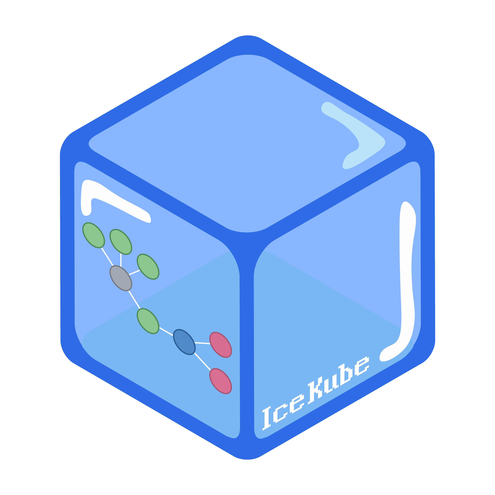

# IceKube

<p align="center">
  
</p>

IceKube is a tool to help find attack paths within a Kubernetes cluster from a low privileged point, to a preferred location, typically `cluster-admin`

## Setup

* `docker-compose up -d` - Spins up neo4j, accessible at `http://localhost:7474/`
* `poetry install --no-dev` (creates venv) *OR* `pip install --user .` (installs the CLI globally)
* Make sure your `kubectl` current context is set to the target cluster, and has `cluster-admin` privileges


* IceKube is also available directly through pip with - `pip install icekube`
* Neo4j can be spun up directly with docker with - `docker run -d -p 7474:7474 -p 7687:7687 -e NEO4J_AUTH=none -v $PWD/data:/data neo4j:4.4`

## Permissions Required

This requires elevated privileges within the target cluster to enumerate resources. This typically requires read-only access on all resources within the cluster including secrets. IceKube does not persist any secret data it retrieves from secrets if that is a concern. 

Resource types can also be filtered from IceKube, instructions can be found below in the `Filtering Resources` section.

## Usage

* `icekube enumerate` - Will enumerate all resources, and saves them into `neo4j` with generic relationships generated (note: not attack path relationships)
* `icekube attack-path` - Generates attack path relationships within `neo4j`, these are identified with relationships having the property `attack_path` which is set to `1`
* `icekube run` - Does both `enumerate` and `attack-path`, this will be the main option for quickly running IceKube against a cluster
* `icekube purge` - Removes everything from the `neo4j` database
* Run cypher queries within `neo4j` to discover attack paths and roam around the data, attack relationships will have the property `attack_path: 1`

**NOTE**: In the `neo4j` browser, make sure to disable `Connect result nodes` in the Settings tab on the bottom left. This will stop it rendering every possible relationship automatically between nodes, leaving just the path queried for

The contents of the cluster can also be downloade with `icekube download` or through [freezer](https://github.com/WithSecureLabs/freezer) (a rust implementation of `icekube download`) and then loaded in through `icekube load`.

#### Filtering Resources

It is possible to filter out specific resource types from enumeration. This can be done with the `--ignore` parameter to `enumerate` and `run` which takes the resource types comma-delimtied. For example, if you wish to exclude events and componentstatuses, you could run `icekube run --ignore events,componentstatuses` (NOTE: this is the default)

Sensitive data from secrets are not stored in IceKube, data retrieved from the Secret resource type have their data fields deleted on ingestion. It is recommended to include secrets as part of the query if possible as IceKube can still analyse the secret type and relevant annotations to aid with attack path generation. 

## Not sure where to start?

Here is a quick introductory way on running IceKube for those new to the project:

* `poetry install` - Installs dependancies using `poetry`
* `poetry shell` - Create a shell within the python environment
* `docker-compose up -d` - Creates the neo4j docker container with easy to use network and environment settings (give this a minute for `neo4j` to start up)
* `icekube run` - Analyse a cluster using IceKube - this assumes your `kubectl` context is set appropriately to target a cluster
* Open the neo4j browser at `http://localhost:7474/`
* On the login form, simply click `Connect` - wait for the connection to be established
* Click the cog wheel on the bottom left to open settings
* Near the bottom of the new side-pane, de-select `Connect result nodes`
* Enter the following query into the query bar at the top
    * `MATCH p = SHORTEST 1 (src)-[r {attack_path: 1}]->+(crb:ClusterRoleBinding)-[:GRANTS_PERMISSION {attack_path: 1}]->(cr:ClusterRole {name: "cluster-admin"}) RETURN p`
    * This will find routes to cluster administrator from service accounts, pods, users, or groups
* Of the new window made with the query, click the Fullscreen button
* Roam around the graph generated, clicking on nodes or relationships to get more details on the right where wanted

## Example Cypher Queries

The following query will find all resources that have `cluster-admin` permissions. This is enforced through a Cluster Role Binding to ensure the permissions are cluster-wide

```cypher
MATCH p = SHORTEST 1 (src)-[r {attack_path: 1}]->+(crb:ClusterRoleBinding)-[:GRANTS_PERMISSION {attack_path: 1}]->(cr:ClusterRole {name: "cluster-admin"}) RETURN p
```

This performs the same, but restricts the query to start at nodes of type Pod / ServiceAccount / User / Group

```cypher
MATCH p = SHORTEST 1 (src)-[r {attack_path: 1}]->+(crb:ClusterRoleBinding)-[:GRANTS_PERMISSION {attack_path: 1}]->(cr:ClusterRole {name: "cluster-admin"}) WHERE (src:ServiceAccount OR src:Pod or src:User or src:Group) RETURN p
```

Using the old `shortestPath` syntax:

```cypher
MATCH (crb:ClusterRoleBinding)-[r:GRANTS_PERMISSION {attack_path: 1}]->(cr:ClusterRole {name: 'cluster-admin'})
WITH crb, cr, r
MATCH (src) WHERE src:ServiceAccount OR src:Pod OR src:User or src:Group
WITH src, crb, cr, r
UNWIND src as s
MATCH p=shortestPath((s)-[*]->(crb))
WHERE all(r in relationships(p) where r.attack_path is not null)
RETURN p, cr, r
```

## Acknowledgements

- [BloodHound](https://github.com/BloodHoundAD/BloodHound) - The original project showing the power of graph databases for security
- [KubeHound](https://github.com/DataDog/KubeHound) - An excellent and similar tool by DataDog, clearly we had similar ideas!
